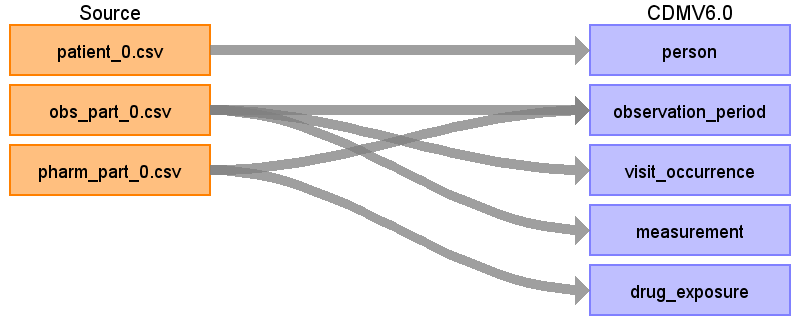
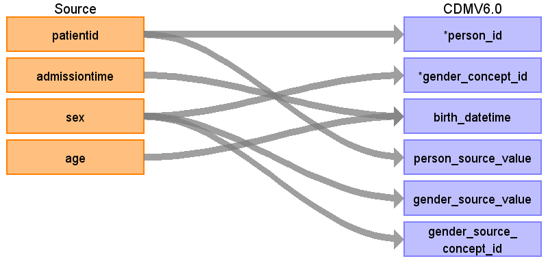
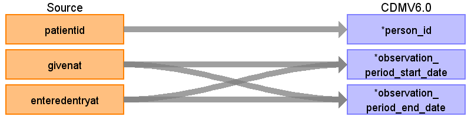
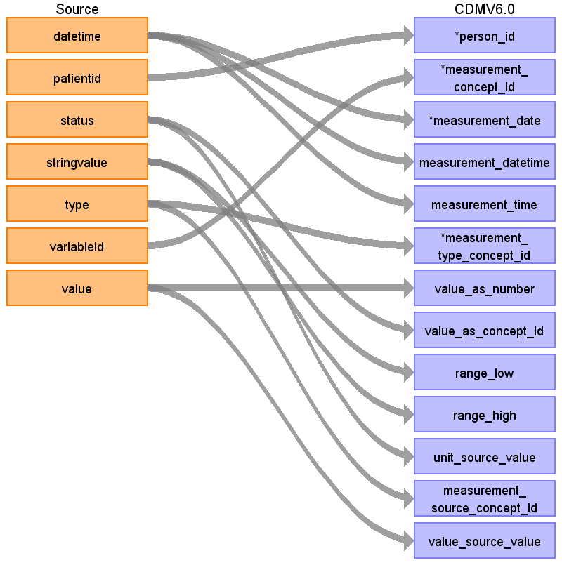

# Source Data Mapping Approach to CDMV6.0

## Table name: person

### Reading from patient_0.csv

| Destination Field | Source field | Logic | Comment field |
| --- | --- | --- | --- |
| person_id | patientid |  |  |
| gender_concept_id | sex | IF sex=='F' THEN 8532  ELSE 8507 |  |
| year_of_birth |  |  | YEAR(birth_datetime) |
| month_of_birth |  |  | MONTH(birth_datetime) |
| day_of_birth |  |  | DAY(birth_datetime) |
| birth_datetime | age  admissiontime |  | birth_datetime=admissiontime-age |
| death_datetime |  |  |  |
| race_concept_id |  |  | NULL |
| ethnicity_concept_id |  |  | NULL |
| location_id |  |  | NULL |
| provider_id |  |  | NULL |
| care_site_id |  |  | NULL |
| person_source_value | patientid |  |  |
| gender_source_value | sex |  |  |
| gender_source_concept_id | sex |  |  |
| race_source_value |  |  | NULL |
| race_source_concept_id |  |  | NULL |
| ethnicity_source_value |  |  | NULL |
| ethnicity_source_concept_id |  |  | NULL |

## Table name: observation_period

### Reading from obs_part_0.csv

| Destination Field | Source field | Logic | Comment field |
| --- | --- | --- | --- |
| observation_period_id |  |  | autogenerated |
| person_id | patientid |  |  |
| observation_period_start_date | entertime |  | If entertime is the oldest between measurements then:  	observation_period_start_date=measurement.datetime  else:  	observation_period_start_date=oldest date(either from givenat or enteredentryat) |
| observation_period_end_date | entertime |  | If entertime is the newest in measurements then:  	observation_period_start_date=measurement.datetime  else:  	observation_period_start_date=newest date(either from givenat or enteredentryat) |
| period_type_concept_id |  |  | period_type_concept_id=44814724 .... this represents the period type covering healthcare encounters |

### Reading from pharm_part_0.csv

| Destination Field | Source field | Logic | Comment field |
| --- | --- | --- | --- |
| observation_period_id |  |  | autogenerated |
| person_id | patientid |  |  |
| observation_period_start_date | enteredentryat  givenat |  | If entertime is the oldest between measurements then:  	observation_period_start_date=measurement.datetime  else:  	observation_period_start_date=oldest date(either from givenat or enteredentryat) |
| observation_period_end_date | givenat  enteredentryat |  | If entertime is the newest in measurements then:  	observation_period_start_date=measurement.datetime  else:  	observation_period_start_date=newest date(either from givenat or enteredentryat) |
| period_type_concept_id |  |  | period_type_concept_id=44814724 .... this represents the period type covering healthcare encounters |

## Table name: visit_occurrence

### Reading from obs_part_0.csv

| Destination Field | Source field | Logic | Comment field |
| --- | --- | --- | --- |
| visit_occurrence_id |  |  |  |
| person_id |  |  |  |
| visit_concept_id |  |  |  |
| visit_start_date | datetime | MIN(DATE(datetime)) |  |
| visit_start_datetime | datetime | MIN(datetime) |  |
| visit_end_date | entertime | DATE(MAX(entertime)) |  |
| visit_end_datetime | entertime | MAX(entertime) |  |
| visit_type_concept_id |  |  | Use the conceptID=32037 for Intensive Care |
| provider_id |  |  | 0 |
| care_site_id |  |  | 0 |
| visit_source_value |  |  | 0 |
| visit_source_concept_id |  |  | 0 |
| admitted_from_concept_id |  |  | Put 32199 for Information not available |
| admitted_from_source_value |  |  | NULL |
| discharge_to_concept_id |  |  | 0 |
| discharge_to_source_value |  |  | 0 |
| preceding_visit_occurrence_id |  |  | NULL |

## Table name: measurement

### Reading from obs_part_0.csv

| Destination Field | Source field | Logic | Comment field |
| --- | --- | --- | --- |
| measurement_id |  |  |  |
| person_id | patientid |  |  |
| measurement_concept_id | variableid | Generate a table SOURCE_TO_sTANDARD_VOCAB_MAP, select and replace values  Source vocabulary for that is LOINC  Remove value that has not mapping |  |
| measurement_date | datetime | DATE(datetime) |  |
| measurement_datetime | datetime |  |  |
| measurement_time | datetime | TIME(datetime) |  |
| measurement_type_concept_id | type | IF NOT ISNULL(status) then 42530833  ELSE 0 |  |
| operator_concept_id |  |  |  |
| value_as_number | value |  |  |
| value_as_concept_id | status | CASE     WHEN 1=out of range THEN 45878591    WHEN 2=invalidated THEN    WHEN 4=first of connection THEN    WHEN 8=caused by event THEN     WHEN16=compressed THEN    WHEN 32=notified, not measured THEN    WHEN 64=is bigger than THEN 45880425    WHEN 128=is smaller than THEN    WHEN 1024=mandatory THEN  END |  |
| unit_concept_id |  |  |  |
| range_low | stringvalue | IF status=64 THEN stringvalue  else 0 |  |
| range_high | stringvalue | IF status=128 THEN stringvalue  else 0 |  |
| provider_id |  |  |  |
| visit_occurrence_id |  |  |  |
| visit_detail_id |  |  |  |
| measurement_source_value |  |  |  |
| unit_source_value | status |  |  |
| measurement_source_concept_id | type |  |  |
| value_source_value | value |  |  |

## Table name: drug_exposure

### Reading from pharm_part_0.csv

| Destination Field | Source field | Logic | Comment field |
| --- | --- | --- | --- |
| drug_exposure_id |  |  | AUTOGENERATED |
| person_id | patientid |  |  |
| drug_concept_id | pharmaid | Generate a table SOURCE_TO_sTANDARD_VOCAB_MAP, select and replace values  Source vocabulary for that is LOINC  Remove value that has not mapping |  |
| drug_exposure_start_date | givenat | DATE(givenat) |  |
| drug_exposure_start_datetime | givenat |  |  |
| drug_exposure_end_date | givenat | DATE(givenat) | Given that we do not have data of the drug exposre at the end  the date is going to be the same |
| drug_exposure_end_datetime | givenat |  |  |
| verbatim_end_date | enteredentryat |  |  |
| drug_type_concept_id |  |  | The value is 38000180 given that the drug was administrated at the ICU |
| stop_reason |  |  | 0 |
| refills | infusionid | SELECT ROWID FROM  (SELECT givenat   FROM  infusionid=value(infusionid))  where givenat=value(givenat) |  |
| quantity | givendose |  |  |
| days_supply |  |  | 0 |
| sig |  |  | 0 |
| route_concept_id | route | IF (iv-inf) then 45884925  ELSE IF (cv-inf) then  ELSE IF (iv-inj) then 45877627   ELSE IF (ms) then  ELSE IF (SC-inj) then 45882083  ELSE IF (inhal) then 45880877  ELSE IF (ep-inj) then 45877638  ELSE IF (transcutan) then 45877646  ELSE IF (paravert) then 4170267 --this is SNOMED  x iv-inf    cv-inf  x iv-inj   ms   p os   p.ms   cv-inj  x inhal  x sc-inj  x  paravert.   p rect   p rectal   x transcutan   subling  x ep-inj	   p.o |  |
| lot_number |  |  |  |
| provider_id |  |  |  |
| visit_occurrence_id |  |  |  |
| visit_detail_id |  |  |  |
| drug_source_value | pharmaid |  |  |
| drug_source_concept_id | typeid |  |  |
| route_source_value | route |  |  |
| dose_unit_source_value |  |  |  |

## Table name: visit_detail

## Table name: dose_era

## Table name: drug_era

## Table name: observation

## Table name: condition_occurrence

## Table name: device_exposure

## Table name: fact_relationship

## Table name: note

## Table name: note_nlp

## Table name: procedure_occurrence

## Table name: specimen

## Table name: cohort

## Table name: condition_era

## Table name: cost

## Table name: payer_plan_period

## Table name: care_site

## Table name: location

## Table name: provider

## Table name: cdm_source

## Table name: metadata

## Table name: cohort_definition

## Table name: survey_conduct

## Table name: location_history

